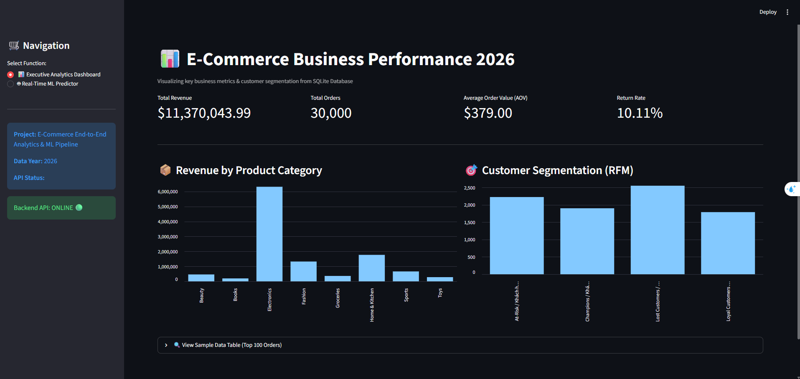
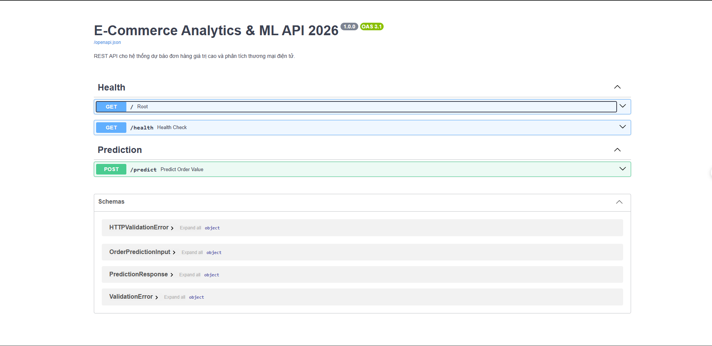

# 🛒 E-Commerce Analytics & Machine Learning Pipeline

<p align="center">
  <a href="https://www.python.org/"></a>
  <a href="https://fastapi.tiangolo.com/"></a>
  <a href="https://streamlit.io/"></a>
  <a href="https://lightgbm.readthedocs.io/"></a>
  <a href="https://www.sqlite.org/"></a>
  <a href="https://opensource.org/licenses/MIT"></a>
  <a href="https://github.com/johnq/E-Commerce-Analytics-ML-Pipeline"></a>
</p>

An End-to-End E-Commerce Analytics & Machine Learning Pipeline that integrates business analytics (SQL & RFM Analytics), an automated training pipeline for predicting high-value orders, a microservice REST API, and an interactive real-time dashboard.

---

## 📌 Description

This project provides a production-ready, modular data science solution designed to address core e-commerce challenges: **customer segmentation** and **order value prediction**. 

Key capabilities include:
* **Automated Data Ingestion:** Safely ingests raw CSV transactional logs into an optimized SQLite relational database.
* **SQL Business Analytics & RFM Engine:** Calculates crucial financial KPIs (Revenue, AOV, MoM Growth) and segments customers into actionable behavioral tiers (*VIP, Loyal, At-Risk, Lost*) using Quantile Scoring.
* **Automated ML Pipeline:** Preprocesses multi-modal features, extracts temporal dimensions, handles class imbalances, and evaluates multiple classifiers (**LightGBM**, **Random Forest**, **Logistic Regression**) to select the top performer based on weighted F1-Score.
* **Production-Grade Microservice:** Exposes structured `/predict` and `/health` REST API endpoints powered by **FastAPI** and **Pydantic** data validation.
* **Executive Dashboard:** A two-in-one interactive **Streamlit** Web UI for real-time executive decision-making and live inference testing.

---

## 📸 Screenshots

| Executive Analytics Dashboard | Real-Time ML Prediction Interface |
| :---: | :---: |
|  |  |

---

## 🛠️ Tech Stack

| Layer | Technologies / Libraries |
| :--- | :--- |
| **Language** | Python 3.10+ |
| **Database** | SQLite3, SQLAlchemy |
| **Data Analytics** | Pandas, NumPy, Scikit-Learn |
| **Machine Learning** | LightGBM, Random Forest, Logistic Regression |
| **Backend Microservice** | FastAPI, Uvicorn, Pydantic |
| **Frontend / Dashboard**| Streamlit |
| **Artifact Management** | Joblib |

---

## 🏗️ System Architecture

```text
[Raw CSV Dataset]
       │
       ▼
[src/db_connector.py] ──────► [SQLite DB: ecommerce.db]
                                      │
       ┌──────────────────────────────┴──────────────────────────────┐
       ▼                                                             ▼
[database/queries.sql & src/rfm_analytics.py]             [src/components/data_transformation.py]
 (Business Metrics & RFM Segmentation)                     (Feature Engineering & Preprocessing)
                                                                     │
                                                                     ▼
                                                          [src/components/model_trainer.py]
                                                           (Train & Select Best ML Model)
                                                                     │
                                                                     ▼
                                                          [models/preprocessor.joblib]
                                                          [models/model.joblib]
                                                                     │
                                                                     ▼
                                                          [src/pipeline/predict_pipeline.py]
                                                                     │
                                                                     ▼
                                                          [FastAPI REST API: api/main.py]
                                                                     │
                                                                     ▼
                                                          [Streamlit App: dashboard/app.py]
📁 Project Directory Structure
Plaintext
E-Commerce-Analytics-ML-Pipeline/
├── api/
│   ├── __init__.py
│   └── main.py                     # Backend REST API server (FastAPI)
├── dashboard/
│   ├── __init__.py
│   └── app.py                      # Interactive Executive Dashboard (Streamlit)
├── data/
│   └── raw/                        # Raw dataset storage (ecommerce_orders_dataset.csv)
├── database/
│   ├── ecommerce.db                # SQLite database storing fact & analytics tables
│   └── queries.sql                 # SQL analytical queries for business metrics
├── docs/
│   └── images/                     # Screenshots and architectural diagrams
├── logs/                           # System logs generated automatically
├── models/                         # Trained artifacts (preprocessor.joblib, model.joblib)
├── src/
│   ├── __init__.py
│   ├── db_connector.py             # Script to ingest raw CSV data into SQLite
│   ├── exception.py                # Custom exception handling class
│   ├── logger.py                   # System logging configuration module
│   ├── rfm_analytics.py            # Customer segmentation engine (RFM)
│   ├── components/
│   │   ├── __init__.py
│   │   ├── data_transformation.py  # Feature engineering, scaling, and encoding
│   │   └── model_trainer.py        # Model training, evaluation & artifact selection
│   └── pipeline/
│       ├── __init__.py
│       ├── predict_pipeline.py     # Real-time inference pipeline
│       └── train_pipeline.py       # Automated end-to-end training pipeline
├── .gitignore                      # Git ignore rules
├── README.md                       # Project documentation
└── requirements.txt                # Dependency list
⚙️ Installation & Requirements
Requirements
Python: 3.10 or higher

OS: Windows 10/11, macOS, or Linux

Git: Version Control System

Quick Installation
Bash
# 1. Clone the repository
git clone [https://github.com/johnq/E-Commerce-Analytics-ML-Pipeline.git](https://github.com/johnq/E-Commerce-Analytics-ML-Pipeline.git)
cd E-Commerce-Analytics-ML-Pipeline

# 2. Create a virtual environment
python -m venv venv

# 3. Activate virtual environment
# Windows (PowerShell):
.\venv\Scripts\Activate.ps1
# Linux / macOS:
source venv/bin/activate

# 4. Install required packages
pip install -r requirements.txt
🚀 Execution Guide
1. Execute Data Pipeline & Model Training
Execute the commands below in sequence to populate the database and train Machine Learning models:

Bash
# Step A: Ingest raw CSV into SQLite
python src/db_connector.py

# Step B: Calculate RFM Customer Segmentation
python src/rfm_analytics.py

# Step C: Run Full Training Pipeline (Transformation + Training)
python src/pipeline/train_pipeline.py
2. Launch Backend API & Interactive Dashboard
Open two separate terminal windows with active virtual environment:

Terminal 1 (FastAPI Server):

Bash
uvicorn api.main:app --reload
Swagger UI API Docs: http://127.0.0.1:8000/docs

Terminal 2 (Streamlit Dashboard):

Bash
streamlit run dashboard/app.py
Web App URL: http://localhost:8501

🔌 API Reference & Usage Sample
POST /predict
Predicts high-value order probability for incoming payload data.

Request Payload Example:

JSON
{
  "order_date": "2026-08-15",
  "product_category": "Electronics",
  "quantity": 2,
  "payment_method": "Credit Card",
  "shipping_cost": 15.0,
  "discount_applied": 5.0,
  "customer_age": 30,
  "membership_status": "Gold",
  "traffic_source": "Direct",
  "device_type": "Mobile"
}
Response Example:

JSON
{
  "is_high_value_order": 1,
  "high_value_probability": 0.8745,
  "status": "success"
}
🗺️ Roadmap
[x] Initial SQLite & LightGBM Baseline Engine.

[x] FastAPI Microservice Deployment.

[x] Executive Streamlit Dashboard.

[ ] Containerize via Docker & Docker-Compose.

[ ] Add CI/CD Workflow via GitHub Actions.

💬 Support & Contact
If you have any questions or feedback regarding this pipeline:

Issue Tracker: Open an issue via GitHub Issues

Author: John Q — GitHub Profile